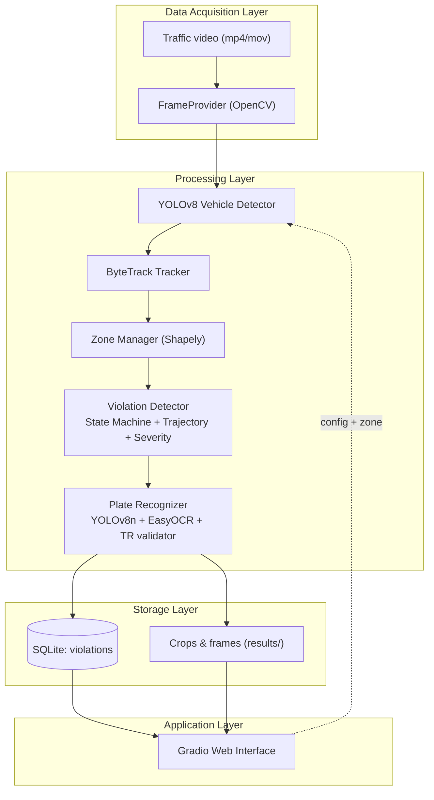
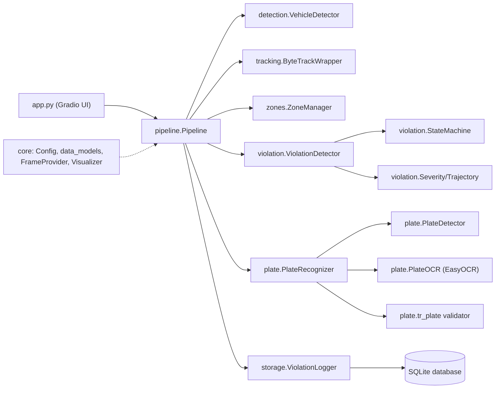
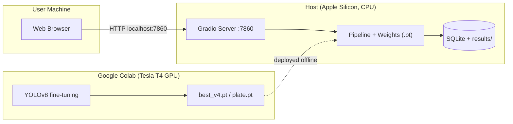
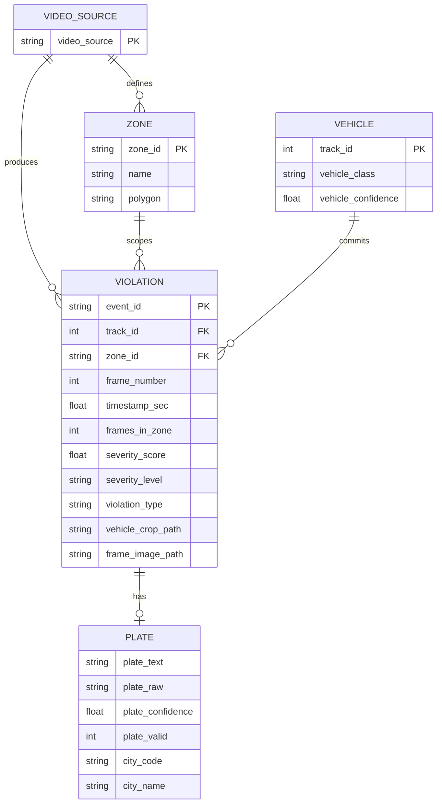
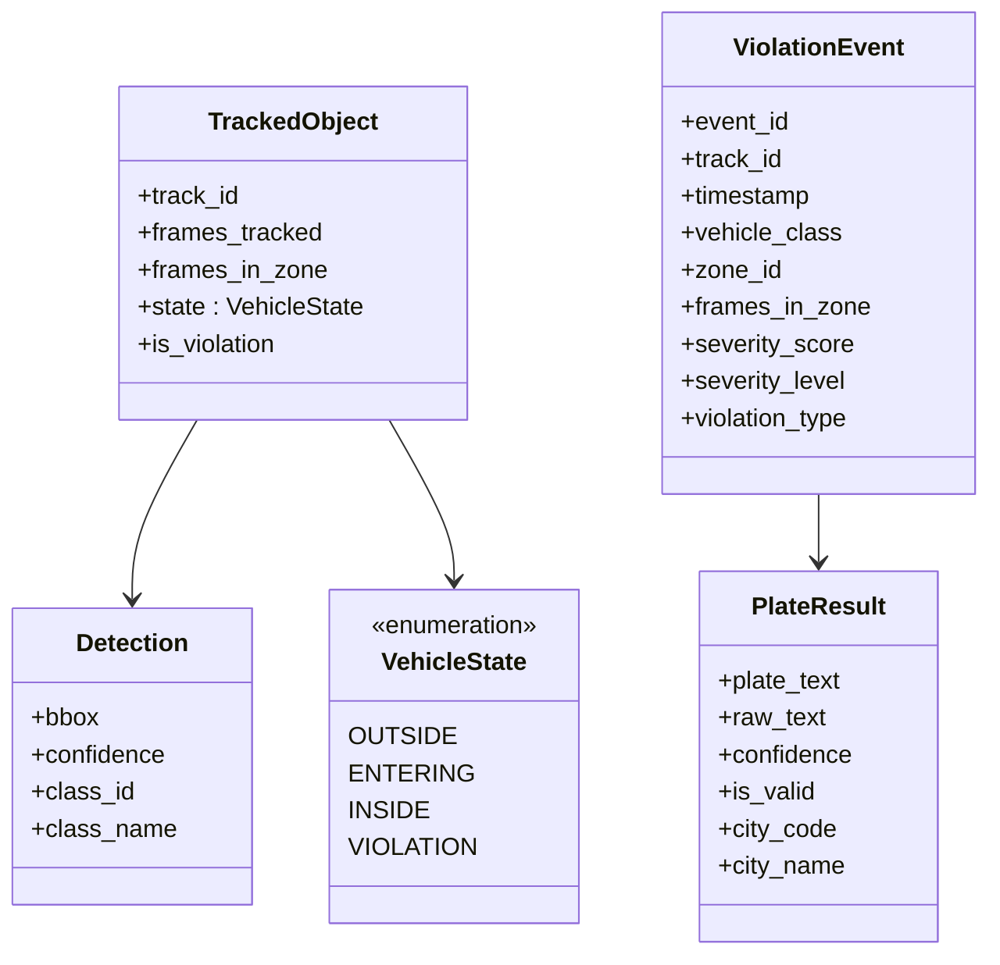
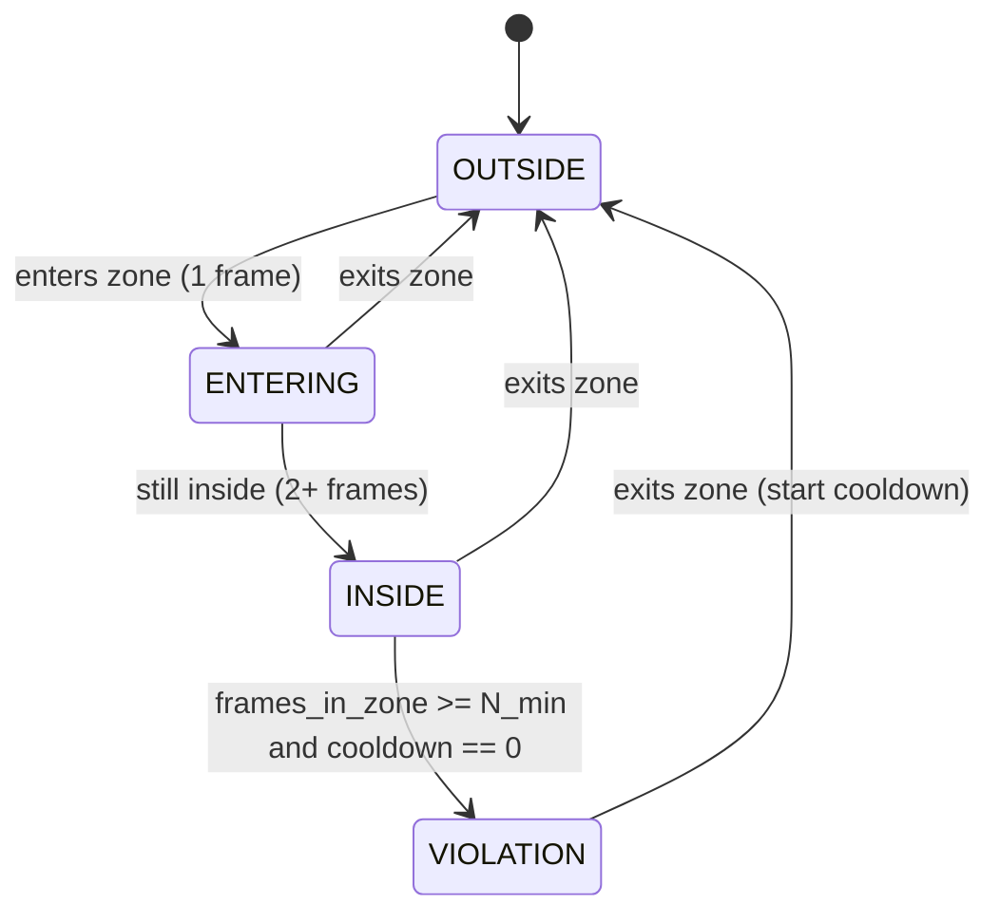
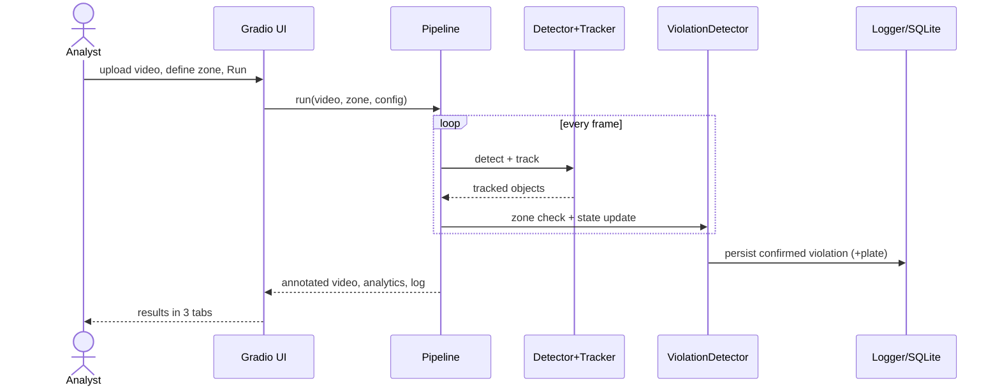

# 9. System / Application Demo

> **PLACEMENT NOTE.** This file follows the thesis template headings **exactly**
> (9.1 – 9.19 + the closing summary table). Do not rename or drop any heading.
> Replace each template instruction block with the prose below.
>
> **Figures.** ALL figures are already rendered as PNGs in
> `docs/thesis/figures/ch9/` — including every Mermaid diagram (already exported to
> `ch9_architecture.png`, `ch9_component.png`, `ch9_deployment.png`, `ch9_er.png`,
> `ch9_class.png`, `ch9_state.png`, `ch9_sequence.png`). Just insert the PNGs in
> Word. The Mermaid code blocks are kept below only as **editable source** in case
> you want to tweak a diagram (paste into <https://mermaid.live>). Captions are
> 11 pt TNR, centered, below each figure. Only `ch9_08_analytics.png` is still to be
> captured (see note at the end).

---

## 9.1. Purpose of the System Demonstration

This section presents the practical implementation of the proposed solution. The
goal is to show that the system is functional and usable, that the trained model is
integrated into a real, interactive application, and that the solution works beyond
the offline metrics reported in Chapter 7. The system is delivered as a Gradio web
application (`app.py`) served at `http://localhost:7860`; it uses the same
configuration file (`configs/config.yaml`) and pipeline code (`src/pipeline/`) as
the command-line runner evaluated in Chapter 7, so the behaviour demonstrated here
is identical to the behaviour measured quantitatively.

## 9.2. System Overview

**What the system does.** Given a fixed-camera traffic video, the system detects
four vehicle classes (car, truck, bus, motorcycle) with a fine-tuned YOLOv8 model,
assigns each vehicle a persistent identity with ByteTrack, checks whether the
vehicle's ground-contact point enters a user-defined hatched-area polygon
(Shapely), and confirms a violation only after the vehicle remains inside the zone
for a minimum number of consecutive frames. Each confirmed violation is classified
by type (`CRUISING` / `EDGE_CONTACT` / `LANE_CHANGE`), graded with a 0–100 severity
score, and — when enabled — the offending vehicle's Turkish licence plate is read
and validated.

**Target users.** The intended user is a *traffic analyst / enforcement operator*
who needs to review footage for hatched-area misuse without writing code.

**Main functionalities.** Upload a video and preview its first frame; define the
hatched-area zone interactively; configure detection thresholds and toggle plate
recognition; run the full pipeline with one button; and review the results in three
tabs (annotated video, analytics, and a violation log with cropped evidence).

### Use Case Diagram

A single human actor, the *Traffic Analyst*, drives the workflow. Running the
detection conceptually **includes** defining the zone and configuring the settings,
and licence-plate recognition **extends** the run as an optional, checkbox-controlled
stage.

> **[FIGURE 9.1 — `ch9_usecase_diagram.png`]**
> *Figure 9.1. Use case diagram of the hatched-area violation detection system.*

### Detailed Use Case Descriptions

**Table 9.1.** Use case description — *Define Hatched-Area Zone*.

| Field | Description |
|---|---|
| Use Case Name | Define Hatched-Area Zone |
| Actor(s) | Traffic Analyst |
| Description | The analyst marks the hatched road area on the first video frame. |
| Preconditions | A video has been uploaded and its first frame is displayed. |
| Main Flow | 1. The analyst clicks the corners of the hatched area on the preview. 2. The system draws the polygon and stores the vertices as JSON. 3. The analyst repeats until the polygon encloses the markings. |
| Alternative Flow | The analyst pastes a JSON coordinate list instead of clicking; *Undo* removes the last vertex and *Clear* resets the polygon. |
| Postconditions | A valid polygon (≥ 3 vertices) is stored, ready for the pipeline. |

**Table 9.2.** Use case description — *Run Violation Detection*.

| Field | Description |
|---|---|
| Use Case Name | Run Violation Detection |
| Actor(s) | Traffic Analyst |
| Description | The analyst runs the full pipeline over the uploaded video. |
| Preconditions | A video is uploaded and a valid zone polygon is defined. |
| Main Flow | 1. The analyst sets confidence/IoU and the plate toggle. 2. Presses *Run Detection*. 3. For each frame the system runs detection → tracking → zone check → state-machine update. 4. On a confirmed violation it scores it and, if enabled, reads the plate. 5. A progress indicator reports the current frame and violation count. |
| Alternative Flow | If plate recognition cannot initialise, the system logs a warning and continues with it disabled rather than aborting. |
| Postconditions | An annotated video, an analytics chart, and a violation log are produced. |

**Table 9.3.** Use case description — *Inspect Violation Log & Evidence*.

| Field | Description |
|---|---|
| Use Case Name | Inspect Violation Log & Evidence |
| Actor(s) | Traffic Analyst |
| Description | The analyst reviews the structured per-violation record. |
| Preconditions | A detection run has completed. |
| Main Flow | 1. The analyst opens the *Violations* tab. 2. The system shows one table row per violation (time, track ID, class, plate, city, score, level, type, frames-in-zone). 3. The analyst inspects the cropped snapshot of each violating vehicle. |
| Alternative Flow | If no violation is confirmed, the table and gallery are empty. |
| Postconditions | The analyst has a per-violation record usable as evidence. |

## 9.3. System Architecture

The system is organised into four layers with a strictly downward data flow:
a **data-acquisition layer** (the uploaded video, read frame-by-frame by
`FrameProvider`), a **processing layer** (YOLOv8 detection, ByteTrack tracking,
Shapely zone checking, the temporal state machine, trajectory/severity scoring, and
plate recognition), a **storage layer** (a SQLite database plus cropped image
artefacts under `results/`), and an **application layer** (the Gradio web
interface). Modules communicate only through shared dataclasses (`Detection`,
`TrackedObject`, `ViolationEvent`), which keeps the layers loosely coupled.

> **[FIGURE 9.2 — render `ch9_architecture.png` from the Mermaid below]**
> *Figure 9.2. Layered system architecture and data flow.*

## 9.4. Component, Package and Deployment Models

The software is decomposed into single-responsibility packages under `src/`
(`detection`, `tracking`, `zones`, `violation`, `plate`, `storage`, `core`,
`pipeline`), orchestrated by a single `Pipeline` class and exposed through `app.py`.
The system is deployed as a local web application: a browser talks over HTTP to a
Gradio server running on the host machine (CPU inference on Apple Silicon); the
model weights (`best_v4.pt`, `plate.pt`) are loaded at start-up, and results are
written to a local SQLite file. Model training is performed off-line on Google
Colab (Tesla T4 GPU) and only the resulting weight files are deployed.

> **[FIGURE 9.3 — render `ch9_component.png` from the Mermaid below]**
> *Figure 9.3. Component diagram of the main software modules and their dependencies.*

> **[FIGURE 9.4 — render `ch9_deployment.png` from the Mermaid below]**
> *Figure 9.4. Deployment diagram. Training runs off-line on Colab; the demo runs
> locally with CPU inference.*

## 9.5. Data Models (Entity-Relationship (ER Diagrams))

Conceptually the system records, for each **video source**, one or more **zones**;
each tracked **vehicle** that violates a zone produces a **violation event**, and
each violation event may carry one recognised **plate**. The implementation stores
this in a single denormalised `violations` table (one row per confirmed event) for
simplicity, with the logical entities below.

> **[FIGURE 9.5 — render `ch9_er.png` from the Mermaid below]**
> *Figure 9.5. Entity-relationship data model of the violation records.*

## 9.6. Problem Domain Class/Object Models

The problem-domain objects are implemented as Python dataclasses in
`src/core/data_models.py`. A `TrackedObject` wraps a `Detection` and carries a
`VehicleState`; a confirmed event becomes a `ViolationEvent`, which may reference a
`PlateResult`.

> **[FIGURE 9.6 — render `ch9_class.png` from the Mermaid below]**
> *Figure 9.6. Problem-domain class model.*

## 9.7. Dynamic Models

The dynamic behaviour is modelled with two diagrams based on the *Run Violation
Detection* use case: a **state machine** describing how a single tracked vehicle
moves between zone states, and an **activity diagram** describing the end-to-end
session workflow.

**State machine.** Each track is `OUTSIDE` until its ground point enters the zone
(`ENTERING`); if it stays it becomes `INSIDE`; once it has accumulated
`min_frames_in_zone` consecutive frames inside (with no active cooldown) it is
promoted to `VIOLATION` and a cooldown is started to prevent re-counting; leaving
the zone returns the track to `OUTSIDE`.

> **[FIGURE 9.7 — render `ch9_state.png` from the Mermaid below]**
> *Figure 9.7. State machine of a tracked vehicle relative to the hatched zone.*

> **[FIGURE 9.8 — `ch9_activity_diagram.png`]**
> *Figure 9.8. Activity diagram of the end-to-end demo workflow; the dashed block is
> repeated for every video frame.*

**Sequence.** The interaction between the analyst, the interface, the pipeline, and
the storage layer during a run is shown below.

> **[FIGURE 9.9 — render `ch9_sequence.png` from the Mermaid below]**
> *Figure 9.9. Sequence diagram of a detection run.*

## 9.8. User Interface (UI)

The interface is a single-page web application with a control column on the left and
a preview/results area on the right. Five representative screens are shown below.

> **[FIGURE 9.10 — `ch9_03_main_interface.png`]**
> *Figure 9.10. Main interface after a video is uploaded; the first frame is shown
> in the preview with the hatched polygon drawn (red). Purpose: load input and see
> the scene. Displayed: video info, controls, preview. Actions: upload, draw zone.*

> **[FIGURE 9.11 — `ch9_04_settings.png`]**
> *Figure 9.11. Settings panel: confidence threshold, IoU threshold, and the
> licence-plate recognition toggle. Purpose: tune sensitivity. Actions: adjust
> sliders, enable plate recognition.*

> **[FIGURE 9.12 — `ch9_05_zone_definition.png`]**
> *Figure 9.12. Zone-definition panel; polygon vertices stored as JSON with Undo /
> Clear / Run Detection controls. Purpose: define the enforcement area.*

> **[FIGURE 9.13 — `ch9_07_annotated_output.png`]**
> *Figure 9.13. Annotated video screen (Video tab): green boxes for tracked
> vehicles, the hatched zone as a red polygon, and the confirmed violator with a red
> box, severity label, and trajectory trail.*

> **[FIGURE 9.14 — `ch9_09_violations.png`]**
> *Figure 9.14. Violation log screen (Violations tab): one row per violation with
> severity/level/type, and a cropped-snapshot evidence gallery below.*

*(Optional fifth/sixth screen: the Analytics tab — capture as
`ch9_08_analytics.png` and add a Figure here, see note at end.)*

## 9.9. System Workflow

From the user's perspective the system operates end to end as follows:
(1) the user uploads a traffic video; (2) the system displays the first frame for
zone definition; (3) the user draws the hatched-area polygon and sets the
thresholds; (4) on *Run*, the pipeline preprocesses each frame (letterbox resize to
640 × 640) and performs detection, tracking, zone checking, and temporal
confirmation; (5) confirmed violations are scored, optionally plate-read, and
logged; (6) the annotated video, analytics, and violation log are displayed in the
result tabs.

## 9.10. Model Integration

Two trained models are embedded in the system. The vehicle detector (`best_v4.pt`,
a fine-tuned YOLOv8) is loaded at start-up through the Ultralytics API and invoked
per frame via `model.track(persist=True)`, which couples detection and ByteTrack in
a single call. The plate model (`plate.pt`, a fine-tuned YOLOv8n) is loaded lazily
only when plate recognition is enabled; its crops are passed to EasyOCR and then to
the Turkish-format validator. Input frames are NumPy arrays from OpenCV; outputs are
typed dataclasses (`Detection`, `TrackedObject`, `ViolationEvent`) consumed by the
storage and visualisation layers. Model paths and thresholds are read from
`configs/config.yaml`, so a model can be swapped without code changes.

## 9.11. Deployment Details

The application is deployed on a **local machine** (developed and demonstrated on an
Apple Silicon Mac). The runtime is Python 3.12 with Ultralytics, PyTorch, OpenCV,
Shapely, EasyOCR, and Gradio installed in a project virtual environment. Inference
runs on the **CPU**, because the PyTorch backend behind Ultralytics and EasyOCR does
not reliably target Apple's Metal Performance Shaders; `half_precision` is therefore
disabled. The Gradio server binds to `http://localhost:7860`. Model **training** is
deployed separately on **Google Colab** with a Tesla T4 GPU; only the resulting
weight files are copied into `weights/` for the demo.

## 9.12. Performance in Real Use

On the development Mac (CPU), end-to-end throughput is approximately **5–7 frames
per second** on 1080p footage (about 4–7 fps on 4K), which is sufficient for the
project's **offline analysis** use case but not for live, real-time enforcement.
The dominant cost is the per-frame YOLOv8 forward pass; tracking, the Shapely zone
test (< 1 ms), and the state-machine update are negligible by comparison. Plate
recognition adds a small, bounded cost because it runs only on confirmed violations
(best-frame voting over a per-track ring buffer) rather than on every frame.

## 9.13. Example Use Cases

*Scenario — hatched-area enforcement on an overpass clip.* **Input:** a 40-second
1080p video of the E-5 highway near Avcılar and a hand-drawn polygon over the
hatched gore area. **Process:** the system tracks ~50 vehicles per frame, and flags
those that remain inside the gore for ≥ `min_frames_in_zone` consecutive frames.
**Output:** a handful of confirmed violations, each classified as `CRUISING` or
`EDGE_CONTACT` with a severity score, an annotated video, and a per-violation log
with cropped evidence. This is the scenario shown in Section 9.14.

## 9.14. Demonstration Results

The screens below are actual outputs of a complete run on the clip described above.
During processing, a live indicator reports progress and the running violation
count (Figure 9.15). The annotated output (Figure 9.13) shows tracked vehicles, the
hatched zone, and the confirmed violator with its severity label and trajectory
trail. The violation log (Figure 9.14) records each confirmed event with its
timestamp, vehicle class, severity, level, and type, and shows the cropped vehicle
snapshots as evidence.

> **[FIGURE 9.15 — `ch9_06_processing.png`]**
> *Figure 9.15. Live processing indicator reporting the current frame and the
> running confirmed-violation count.*

## 9.15. System Limitations

The demonstration exposes three concrete limitations. **(1) Not real-time:** CPU
inference at 5–7 fps suits offline review but not live deployment. **(2) Small-plate
readability:** on far overpass cameras the offending plates occupy only a few dozen
pixels, so the *Plate* / *City* columns can remain empty (`--`); the plate stage
runs but legibility depends on viewing geometry (consistent with Chapter 8). **(3)
Manual zone definition:** the hatched polygon is drawn by the operator per camera
rather than detected automatically, so the system assumes a fixed camera.

## 9.16. User Experience Considerations

The interface follows the natural left-to-right, top-to-bottom order of the task
(upload → settings → zone → run → review), uses clear section numbering and labels,
and gives immediate feedback through the first-frame preview and the live progress
indicator. Results are separated into three focused tabs to avoid overload. The
interface is intentionally plain rather than decorative: the priority is that the
workflow be clear, logical, and usable by a non-technical operator.

## 9.17. Security Considerations (if applicable)

The demo runs locally and is not exposed to the public internet, so it has no
authentication layer; for any networked deployment, access control and HTTPS would
be required. Regarding data protection, the footage used is from publicly accessible
overpasses and the municipal MOBESE feed, and the system is designed to fit Turkish
data-protection rules (KVKK): it stores only what is needed for enforcement evidence
(vehicle and plate crops of confirmed violators) and processes data locally without
transmission to third parties.

## 9.18. Scalability Considerations

The current single-process design handles one video at a time. Horizontal scaling is
straightforward in principle: because each video is processed independently and the
pipeline is stateless across runs, multiple videos could be processed in parallel
worker processes, and GPU inference (CUDA) would raise per-stream throughput by an
order of magnitude over the current CPU path. The SQLite store is adequate for a
single analyst; a networked, multi-user deployment would migrate it to a
client–server database.

## 9.19. Reproducibility and Access

The full source, configuration, trained-model references, and this chapter are in
the project repository: **github.com/sertacakalin/hatched-area-violation-detection**
*(confirm the final public URL)*. Setup: create the Python 3.12 virtual environment,
install the dependencies, place the weight files in `weights/`, and launch the demo
with `python app.py` (opens `http://localhost:7860`). A short **demo video**
(`docs/figures/demo_30s.mp4`) showing the annotated output with confirmed violations
is recommended as supplementary material for the defence.

---

## System / Application Summary Table

**Table 9.4.** System / application summary.

| Item | Value |
|---|---|
| System name | Hatched Area Violation Detection |
| Type | Local web application (offline video analysis) |
| Primary user | Traffic analyst / enforcement operator |
| Input | Fixed-camera traffic video (mp4 / mov) + user-defined zone polygon |
| Output | Annotated video, analytics chart, SQLite violation log, cropped vehicle/plate evidence |
| Models | YOLOv8 vehicle detector (`best_v4.pt`); YOLOv8n plate detector (`plate.pt`) |
| Key libraries | Ultralytics (YOLOv8 + ByteTrack), Shapely, EasyOCR, Gradio, OpenCV, Plotly |
| Tracking | ByteTrack (persistent IDs) |
| Decision logic | Four-state temporal state machine + severity scoring |
| Deployment | Local (CPU inference, Apple Silicon); training on Google Colab (T4 GPU) |
| Performance | ~5–7 fps on 1080p CPU (offline use) |
| Interface | Gradio web UI at `http://localhost:7860` |
| Repository | github.com/sertacakalin/hatched-area-violation-detection *(confirm URL)* |

---

### Figure → file map (for placement)

| Figure | Source |
|---|---|
| 9.1 Use case | `ch9_usecase_diagram.png` ✅ |
| 9.2 Architecture | Mermaid → `ch9_architecture.png` |
| 9.3 Component | Mermaid → `ch9_component.png` |
| 9.4 Deployment | Mermaid → `ch9_deployment.png` |
| 9.5 ER model | Mermaid → `ch9_er.png` |
| 9.6 Class model | Mermaid → `ch9_class.png` |
| 9.7 State machine | Mermaid → `ch9_state.png` |
| 9.8 Activity | `ch9_activity_diagram.png` ✅ |
| 9.9 Sequence | Mermaid → `ch9_sequence.png` |
| 9.10 Main UI | `ch9_03_main_interface.png` ✅ |
| 9.11 Settings | `ch9_04_settings.png` ✅ |
| 9.12 Zone | `ch9_05_zone_definition.png` ✅ |
| 9.13 Annotated output | `ch9_07_annotated_output.png` ✅ |
| 9.14 Violation log | `ch9_09_violations.png` ✅ |
| 9.15 Processing | `ch9_06_processing.png` ✅ |
| (opt.) Analytics | `ch9_08_analytics.png` — to capture |
